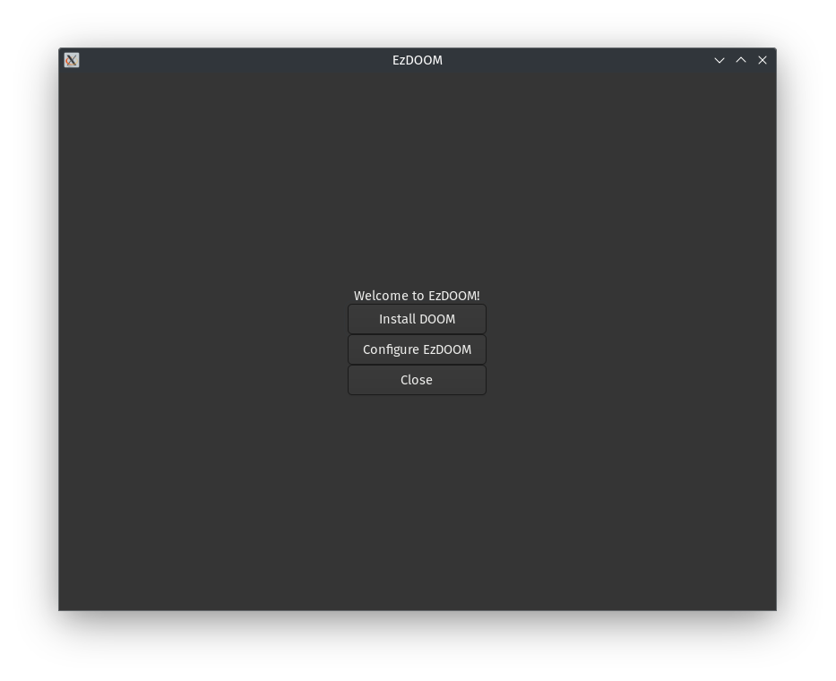
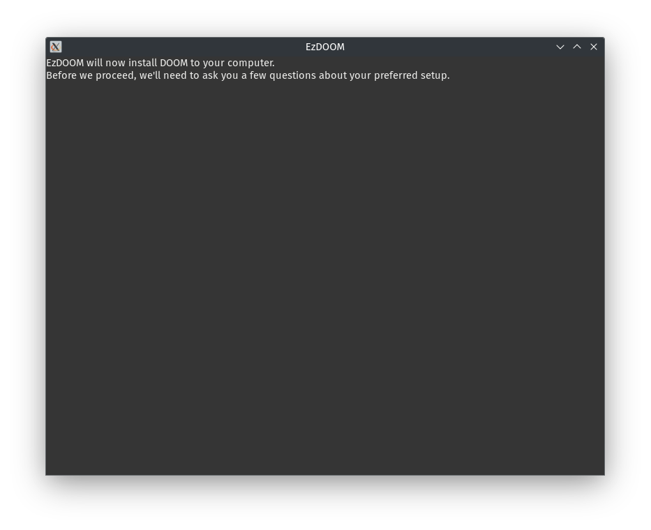

# EzDOOM Development Diary

> [!WARNING]
> This is the ramblings of a guy trying to write an easy installer and manager
> for DOOM and other such idTech 1-based games for Linux, that allows for ease of
> use and not having to grapple with the insanity that is Flatpak.
>
> While this diary is more an outlet for me to complain about how I don't know
> what I'm doing, it also serves as a sort of place to document my progress on
> EzDOOM.
>
> That being said, I may have gone insane a few times throughout the course of
> this mostly unplanned project. I never plan anything unless I have to.
>
> You have been warned.

## 2024-06-06

### 2:59 PM

A main window has already been created as of yesterday, but it doesn't contain
anything useful, just a silly homage to Sonic CD.

To make this page-by-page kind of installation for EzDOOM, I'm going to need
to learn how to make "pages" appear depending on a `page` variable or something
like that.

I have no clue how to do that, so I'm probably just going to skim GTK and
gtk-rs documentation until I understand how this works.

### 3:04 PM

I also need to separate EzDOOM's install wizard from the config utility. And to
do that, I first have to write the install wizard and config utility.

I wonder if there are any Rust development libraries for Flatpak. Considering
EzDOOM will be interfacing with the GZDoom Flatpak in particular, learning
something like that will be beneficial.

### 3:05 PM

Oh, frick, I need to learn how to create, read from and interface with a config
file, don't I? This is gonna be hard.

### 3:08 PM

I wonder if there's something like Qt Designer for GTK. Though if there is, I
still probably shouldn't use it. That kind of graphical environment is handy but
it feels more like a crutch than anything.

### 3:17 PM

And I just got done writing the warning up there instead of actually working
on EzDOOM. Why do I do this to me? I dunno, procrastination is kind of fun
sometimes.

### 3:44 PM

Okay, well now I have SOMETHING, but I still have no clue what I'm doing.

Here's the welcome screen:

And the installer screen:

Yeah, it's not great, is it? I really have no clue what it is I'm supposed
to do with this. I will say, at least it works. At least clicking the
"Install DOOM" button switches to the installer screen.

But I have no clue how I'm supposed to make a page-by-page thing like
this. Surely I'm not expected to create a separate `gtk::Box` just for
each stage of the installation process...

### 3:58 PM

Okay, so now I made a placeholder for the config utility. Clicking the
"Configure EzDOOM" button switches to the config utility screen, as expected.

My head still wants to explode from how much stuff I'm going to have to write
in order to get any of this to do anything I want it to, not even to mention
I have no idea how to create "standard" GTK apps.

So, yeah. Jumping into a project of this scale with a framework I've never
used in my life... not exactly my proudest moment.
